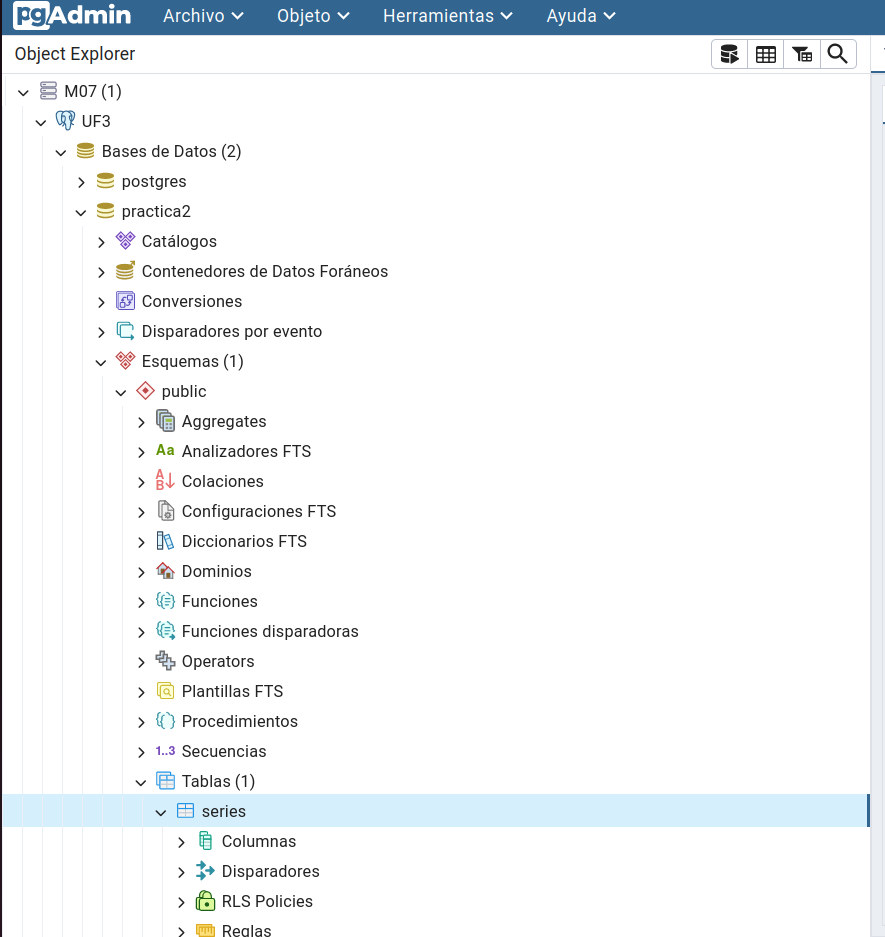
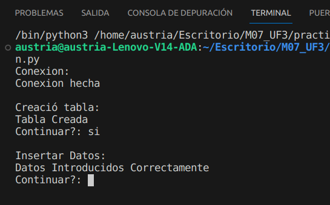
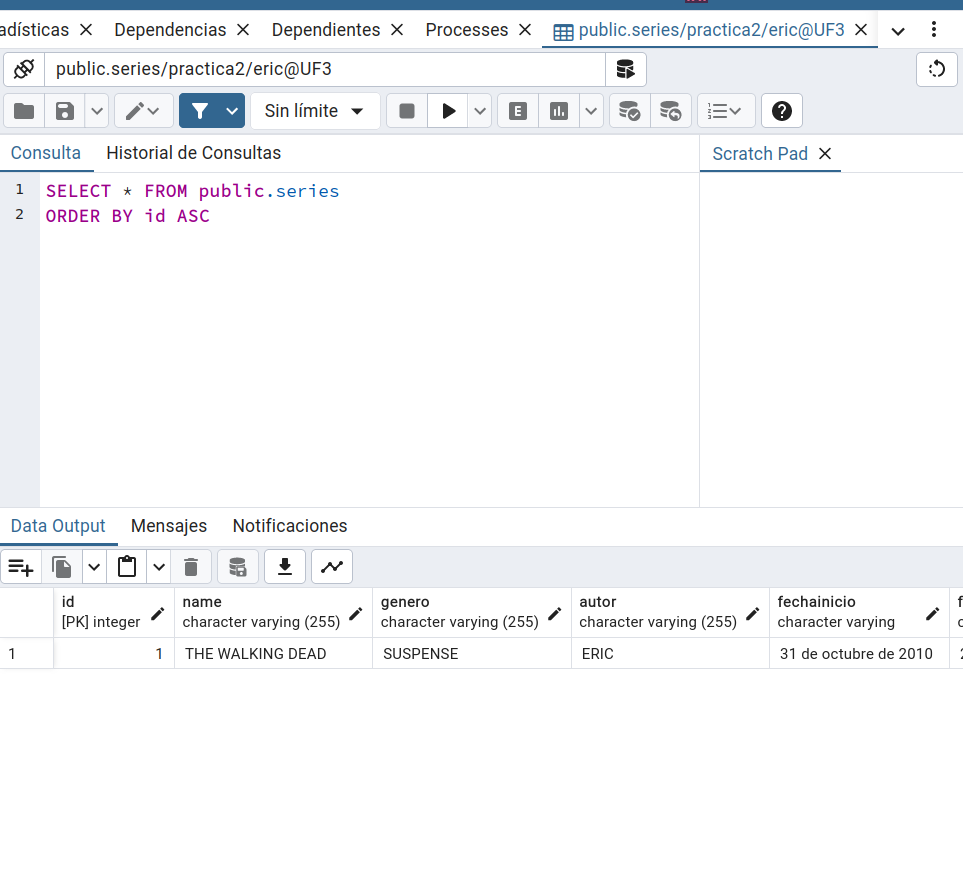
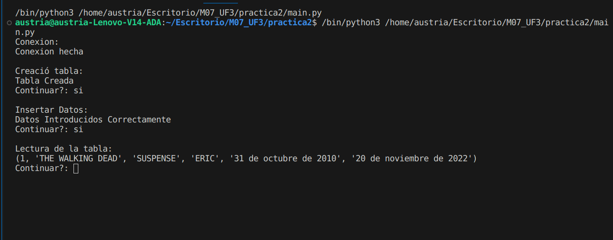
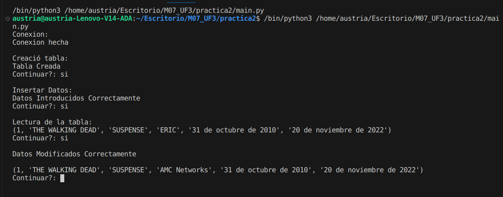
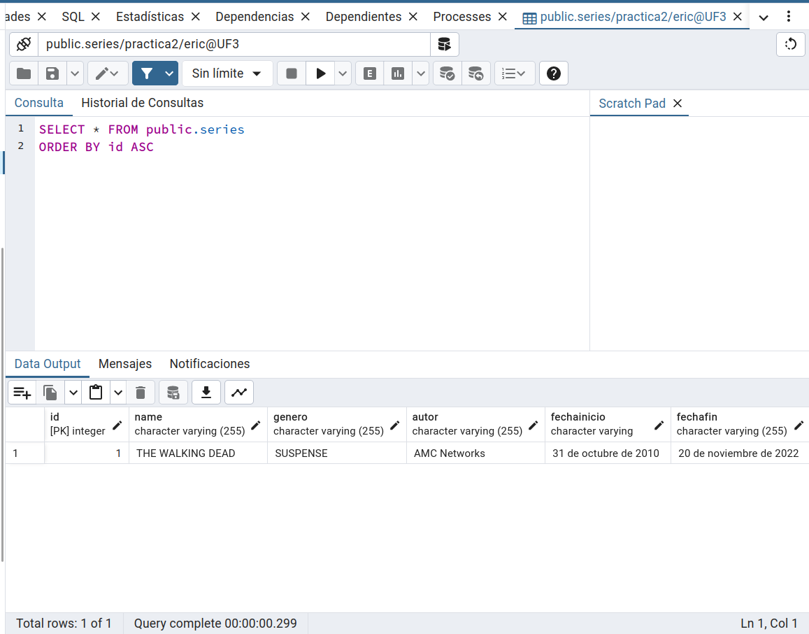
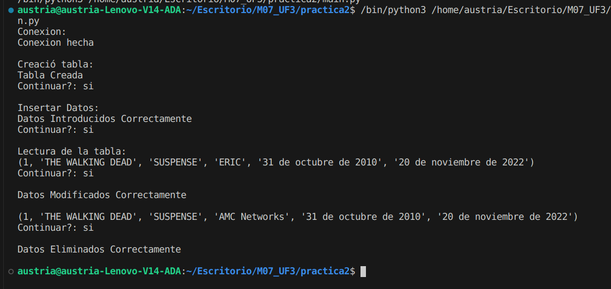
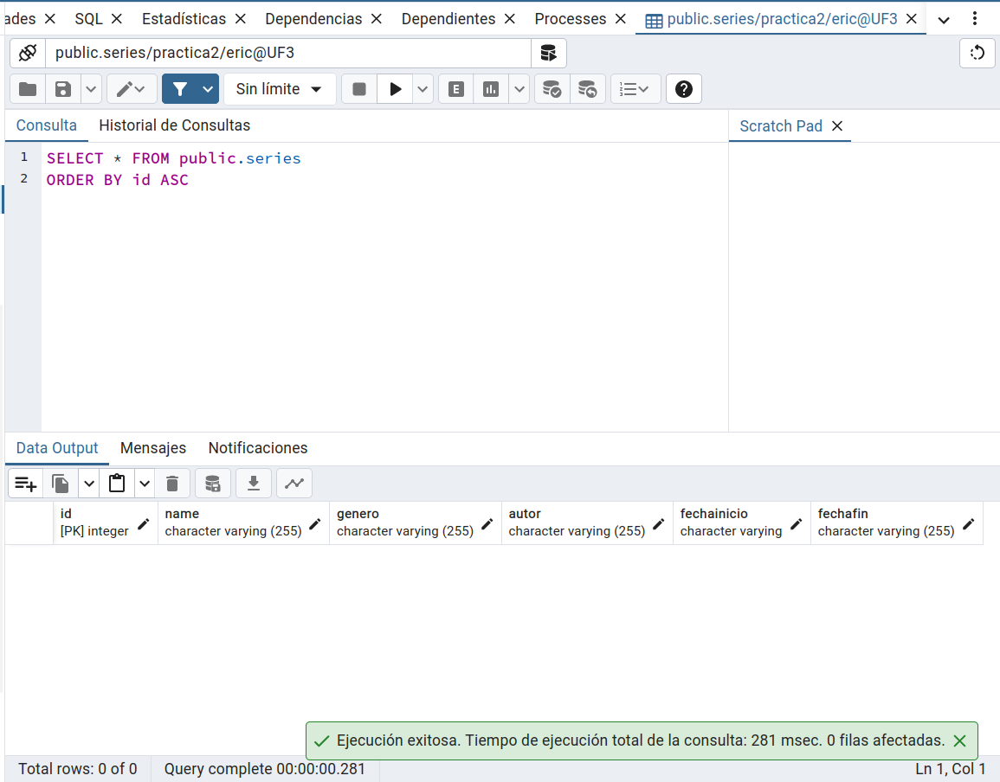

-> IMAGEN de la creación de la Tabla Series

-> IMAGEN de la comprobacion de la creación de la Tabla Series en la base de datos

-> IMAGEN de la Inserción de Datos a la Tabla Series
 

-> IMAGEN de la comprobacion de la Inserción de datos a la base de datos

-> IMAGEN de la Lectura de la Tabla Series por terminal

-> IMAGEN de la Modificación de los datos de la Tabla Series

-> IMAGEN Comprobación de la Modificación de los datos de la Tabla Series

-> IMAGEN de la Eliminacion de los datos de la Tabla Series

-> IMAGEN Comprobación de la Elmininación en la Tabla Series
